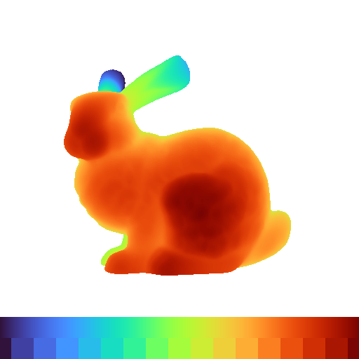

# cppturbo

A header-only, C++ implementation of the [Turbo colormap](https://ai.googleblog.com/2019/08/turbo-improved-rainbow-colormap-for.html)

 

Source for the above image can be found [here](examples/zbuffer.cpp)

## Installation
Simply add `cppturbo.hpp` to your project

If you use cppturbo in cmake project:
```
add_subdirectory(cppturbo)
target_link_libraries(your_library_or_executable cppturbo)
```

## Usage

```cpp
#include "cppturbo.hpp"
```
```cpp
// param[in]  target value in [0.0 - 1.0] or [0 - 255]
const double val_d = 0.5;
const int    val_i = 128;

// param[out] turbo color in float, double, uchar, or int
turbo::Color3f floats;  // [0.0 - 1.0]
turbo::Color3d doubles; // [0.0 - 1.0]
turbo::Color3b uchars;  // [0 - 255]
turbo::Color3i ints;    // [0 - 255]

// Get the turbo color with selected format
turbo::GetColor(
    val_i, // or val_d
    floats // or uchars
);

// Print the RGB values
std::cout << "r:" << floats.r << ", "
          << "g:" << floats.g << ", "
          << "b:" << floats.b << std::endl;
```

## License

[Apache License, Version 2.0](http://www.apache.org/licenses/LICENSE-2.0)

## Acknowledgments

This software contains code from [turbo_colormap.c](https://gist.github.com/mikhailov-work/6a308c20e494d9e0ccc29036b28faa7a)

```
Copyright 2019 Google LLC.
SPDX-License-Identifier: Apache-2.0

Author: Anton Mikhailov
```